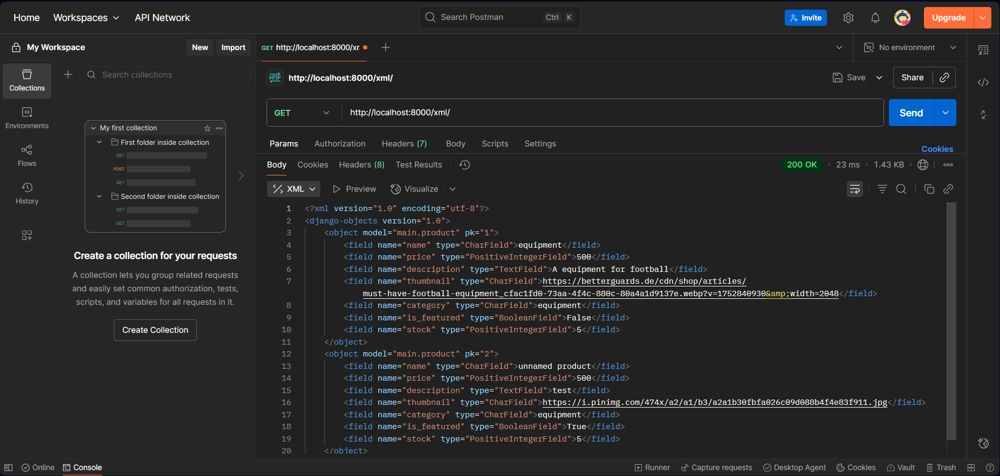
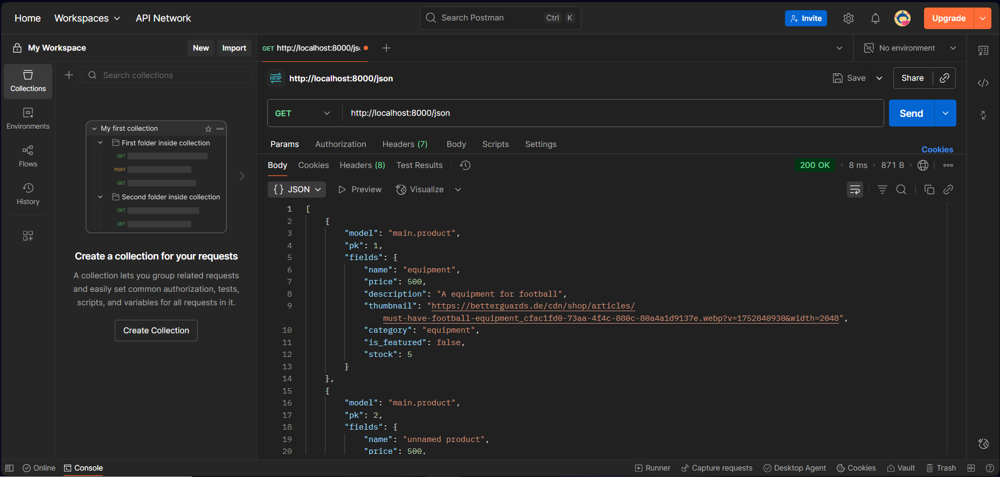
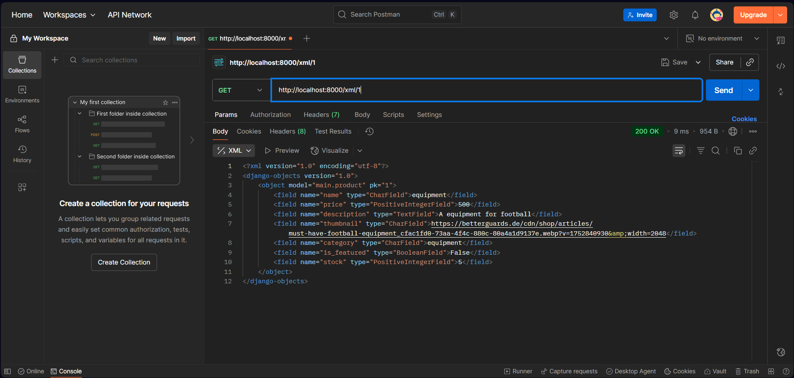
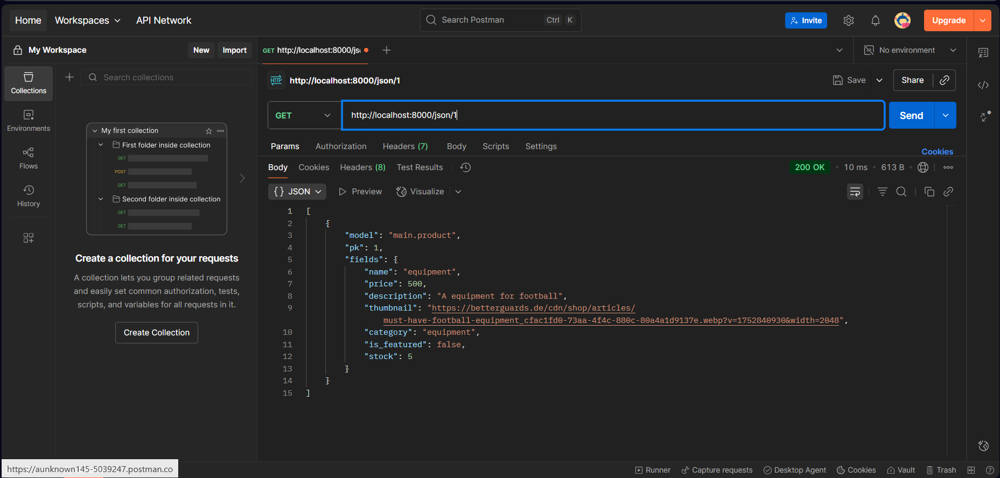

### Tugas 2

## Bagaimana saya menjalankan sesuai arahan checklist tugas.
Apa yang saya lakukan tidak jauh dari apa yang tutorial 1 diajarkan.  
Hanya saja ada tambahan seperti model yang sesuai dengan kriteria tugas 2 dan mendefinisikan nama, tujuan pada aplikasi web tersebut.

## Alur Request-Response Django: Hubungan urls.py, views.py, models.py, dan Template HTML.

__reference: https://krify.co/wp-content/uploads/2019/06/Django-Work-flow.jpg__  

1. Mendapatkan request dari user melalui Django.
2. Kemudian proses melalui URL dan dilanjutkan ke View.
3. View memproses request, bila ada data dari database, View memanggil models.py. Models melakukan query ke database yang hasilnya dikembalikan ke View.
4. Setelah proses selesai, hasilnya dirender melalui HTML.
5. Django mengembalikan HTML menuju user sebagai response.

## Peran settings.py.
Settings.py adalah file yang mengandung semua konfigurasi yang diatur
oleh kita sendiri dan ini memengaruhi behavior dan environment pada django yang kita gunakan. 
Ada beberapa konfigurasi seperti host yang diperbolehkan, mode debug, dan lain-lain.

## Bagaimana migrasi database di Django?
1. Setelah membuat/mengubah `models.py`
2. Jalankan kode `python manage.py makemigrations`
3. Lalu aplikasikan ke basis data `python manage.py migrate`

## Kenapa Django dipilih sebagai materi untuk pemula?
Django memiliki banyak fitur yang sudah tersedia, memudahkan pemula untuk belajar cara menggunakan fiturnya saja. 
Selain itu, Django juga memiliki dokumentasi yang sangat rapih dan komprehensif sehingga
bisa dituju bila ada fitur yang berguna atau mencari cara tahu menggunakannya. 
Django bersifat simpel, fleksibel, konsisten, skalabilitas membuat pemula 
lebih cepat memahami alur kerja pengembangan web tanpa harus membangun segalanya dari nol. Penggunaan
arsitektur MVT juga ikut berperan untuk memudahkan pemula belajar.

## Feedback untuk asisten dosen tutorial 1.
Untuk feedback saya merasa tidak ada, karena saya rasa asisten dosen sudah cukup untuk
menawarkan bantuan. Hebat.

### Tugas 3

## Keperluan dalam data delivery dalam mengimplementasian sebuah platform
Data delivery adalah proses pengiriman data. Misal, dari server ke aplikasi atau dalam projek ini dari database ke pengguna. Tujuannya supaya data yang sudah ada bisa disampai dengan cepat dan aman serta konsisten. 

Jadi data harus disimpan disuatu tempat yang bisa disebut sebagai 'gudang' kemudian data akan di kirim melalui data delivery ke pengguna.

## XML atau JSON?
XML ataupun JSON merupakan format data yang umum digunakan pada keperluan data delivery. XML dirancang untuk mudah dimengerti dengan pengguna hanya membacanya. JSON juga mirip seperti XML yang mudah dibaca. Pemilihan XML atau JSON tergantung dari kelebihan dan kekurangan masing-masing. 

JSON mendukung tipe data sepertin strings, numbers, dan objects selain itu JSON juga dukung boolean arrays. XML tidak bisa tanpa menambahkan tag tambahan. Namun, XML lebih fleksibel dan mendukung tipe data yang kompleks seperti data binari dan timestamps.

## Fungsi dari method is_valid() dalam pembuatan form

Fungsi utama dari `is_valid()` adalah mengecek apakah data yang dikirim ke form sudah sesuai dengan aturan validasi yang ditentukan.

Misal ada form menerima data yang kemudian memanggil method `is_valid()`. Didalamnya, data akan di tes dengan beberapa validasi seperti field yang diharuskan ada, dsb. Kemudian bila valid, maka data akan dibersihkan dan siap dipakai. Jika di projek ini, form akan disimpan setelah siap dipakai. Namun bila tidak valid, maka akan muncul error yang akan dikembalikan ke pengguna.

## Pentingnya csrf_token saat membuat form

CSRF token sangatlah penting karena berfungsi sebagai pelindung dari serangan Cross-Site Request Forgery.

Ibarat sebuah tanda tangan rahasia yang memastikan request memang berasal dari form asli di website sendiri, bukan dari jebakan pihak luar.

Jadi CSRF token bekerja yang diawali dengan menyelipkan kode unik yang acak di setiap form. Kemudian kode ini ikut terkirim saat user sumbit form. Server akan mengecek apakah token cocok dengan yang disimpan sama user. Jika tidak, request ditolak.

## Feedback untuk asisten dosen tutorial 2.
Untuk feedback kepada asisten dosen tutorial 2 sudah cukup dan melaksanakan tugasnya. Keren.

## Penggunaan Postman 
XML

JSON

XML by id

JSON by id

### Tugas 4

## Apa itu Django `AuthenticationForm`?
Django memiliki fungsi bawaan bernama AuthenticationForm yang berfungsi untuk melakukan login user. Jadi Django sudah menyediakan form untuk pengguna bisa login seperti username dan password. Bahkan Django AuthenticationForm juga sudah menyediakan validasi bila username atau password salah tidak akan masuk, namun bila username dan password benar pengguna bisa akses halaman website.

## Perbedaan antara autentikasi dan otorisasi
Autentikasi : the process of proving that something is real, true, or what people say it is.
Otorisasi   : official permission for something to happen, or the act of giving someone official permission to do something.
taken from Cambridge Dictionary

## Kelebihan dan kekurangan session dan cookies

### ✅ Advantages
Session
- Aman secara default
- Kapasistas data yang besar
- Proses yang transparan yang tidak bisa dilihat oleh user
Cookies
- Data bisa digunakan untuk memperbaiki website
- Bisa menyesuaikan rekomendasi ke user

### ❌ Disadvantages
Session
- Biasanya hanya sekali penggunaan
- Performance overheda bila terdapat banyak user 
Cookies
- Tidak aman secara default
- Masalah privasi

## apakah cookies aman secara default?
Cookies secara default tidak aman. Karena informasi di cookies bisa dilihat dan di ubah oleh pengguna. Jika ingin menjadi aman, cookies bisa dikirim melalui HTTPS (Secure).

## Bagaimana saya menjalakan tugas 4 secara step-by-step
1. Saya mengambil bawaan dari Django mengimplementaikan autentikasi seperti register dan login terlebih dahulu dimana pada `views.py` membuat fungsi bernama `register()` dan `login_user()`. Kemudian, kedua fungsi tersebut di routing kan URL nya pada `urls.py`. Biar terlihat rapih, saya membuat file html sendiri-sendiri untuk pengguna register ataupun login.
2. Setelah itu saya membuat fungsi lagi yang fungsinya untuk terminate sesi pengguna sehingga balik ke laman login bernama `logout_user()`. Di bagian laman utama file html saya berikan tombol untuk pengguna bisa logout.
3. Setelah membuat autentikasi sekarang saya membuat otorisasi seperti pengguna yang sudah login bisa melihat produk-produk yang ada di halaman website utama. Caranya dengan mengambil fungsi bawaan dari Django bernama `login_required` yang berfungsi sebagai decarator untuk fungsi-fungsi yang berlaku untuk merestriksi halaman utama dan produk detil.
4. Kemudian saya implementasikan cookies yang bisa berfungsi untuk melihat kapan pengguna baru masuk. 
5. Terakhir saya membuat model produk untuk menghubungkan dengan pengguna. Jadi disini pengguna-pengguna website bisa melihat produk-produk yang dijual dibuat oleh siapa. 

### Tugas 5

## Urutan prioritas CSS selector
1. Inline style
2. External dan internal style sheets
3. Browser default

## Pentingnya responsive design dalam pengembangan aplikasi web
Penggunaan aplikasi web tidak hanya nyangkut di monitor saja tetapi adapun device lain seperti hp bisa membukanya. Namun perbedaan penampilan yang disebabkan hardware device masing-masing membuat aplikasi web harus fleksibel dalam menampilkan websitenya. 
Jadi responsivve web design bertujuan untuk menghasilkan tampilan web yang sesuai dan terlihat baik untuk seluruh perangkat.

## Margin, border, dan padding
Pada box model di CSS terdapat setiap elemen HTML
yang terdiri dari,
1. Content, tempat dimana teks dan gambar
2. Padding, memberi jarak kosong antar content dan border, padding juga bersifat transparan
3. Border, membungkus yang didalamnya padding dan content
4. Margin, bersihkan area diluar border, bersifat transparan

## Flex box dan grid layout
Flexbox dan Grid Layout adalah module dimana Flexbox digunakan untuk satu dimensi layout sedangkan grid layout digunakan untuk dua dimensi layout.

## Penugasan step-by-step
1. Membuat fungsi `delete_product` dan `edit_product`
2. Mempersiapkan konsep static untuk menaruh `global.css`
2. Mengubah visual halaman website dengan menggunakan CSS dan Tailwind
3. Membuat navbar.html dan sesuaikan visualnya dengan yang lain
4. Membuat `card_product.html` sehingga tampilan product terlihat lebih elegan
5. Sesuaikan `main.html` dengan adanya `card_product.html`

## Terima yang lainkasih sudah mengunjungi!
Repositori ini dibuat oleh Farras Syafiq Ulumuddin dari kelas PBP A.  
Link menuju website : [https://farras-syafiq-summitasymptote.pbp.cs.ui.ac.id].
